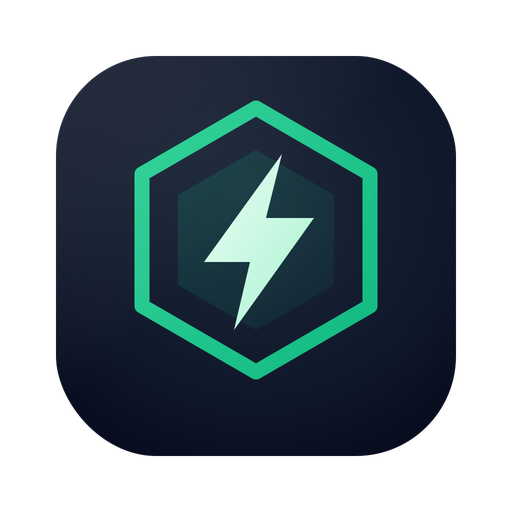
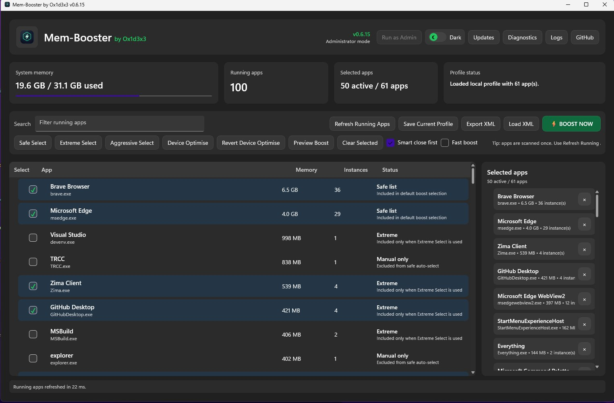
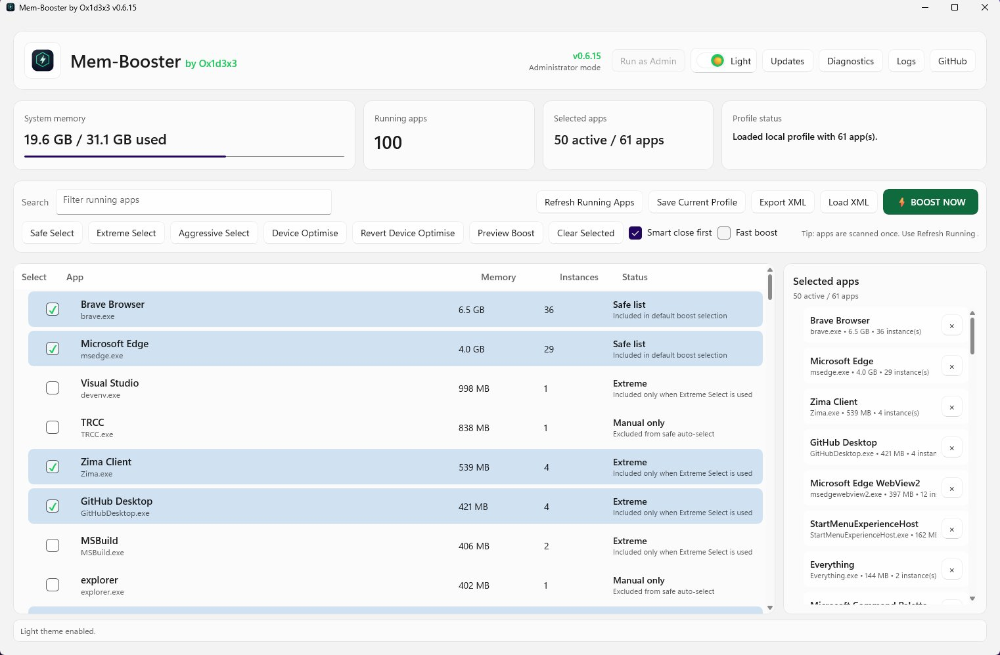
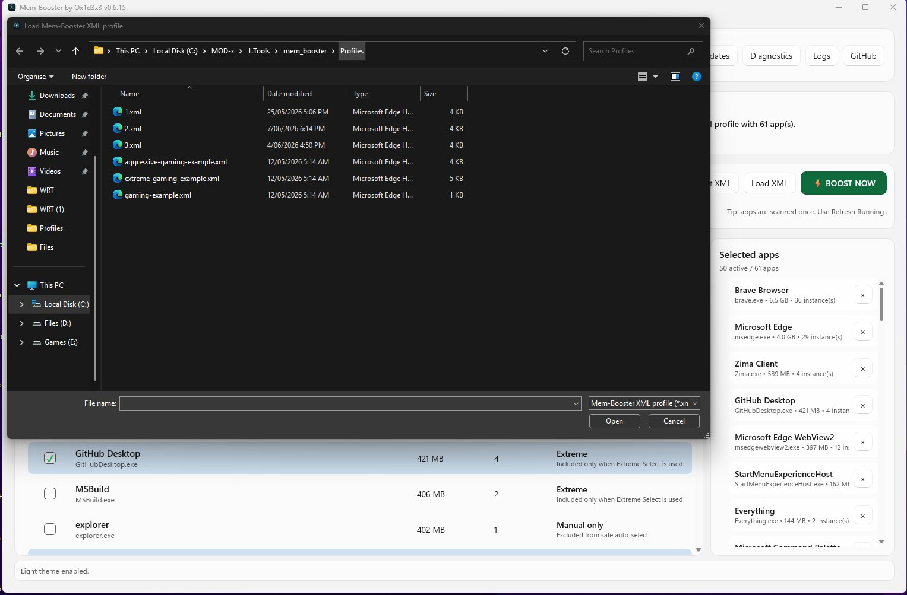

<div align="center">



# Mem-Booster

**A native Windows 11 utility that frees up system resources before a gaming session — safely.**

[](https://www.microsoft.com/windows)
[](https://dotnet.microsoft.com/)
[](https://github.com/ox1d3x3/mem-booster/releases)
[](#build-from-source)

*Created by **Ox1d3x3***

</div>

---

## Overview

Mem-Booster prepares your PC for a cleaner gaming session by closing selected non-gaming background apps, reducing unnecessary background activity, and optionally applying **reversible** Windows 11 gaming-session optimisations.

The goal is simple: **free up system resources before gaming without unsafe "debloat" tricks** that can break Windows, security tools, drivers, launchers, overlays, or anti-cheat systems. Mem-Booster deliberately stays away from anything that could destabilise your system.

---

## Screenshots

### Main view — Dark theme
The dashboard shows live system memory, running app count, your current selection, and profile status. Apps are grouped by executable, sorted by memory use, and labelled with a safety status.



### Main view — Light theme
A single toggle in the header switches between a polished dark and light theme, animated smoothly.



### Load an XML profile
Profiles are portable XML files. Load a shared profile, or one of the bundled examples, straight from disk.



---

## Features

- **Native Windows 11 app** built with .NET 8 and **WinUI 3** (Windows App SDK).
- **Live system snapshot** — memory usage, running app count, and per-app memory grouped by executable.
- **Three one-click selection modes** — Safe, Extreme, and Aggressive.
- **Safety-aware** — protected system, driver, security, launcher, overlay, VPN, and anti-cheat processes are never auto-selected.
- **Local and shareable profiles** — save your selection locally or export/import portable XML profiles.
- **Reversible Device Optimise** — opt-in Windows 11 gaming-session settings that can be rolled back.
- **Optional Fast Boost** and **Smart close first** modes.
- **Dark and light themes** with smooth animated transitions.
- **Detailed logging and one-click diagnostics** for troubleshooting.

---

## Requirements

Mem-Booster requires the **Windows App SDK runtime**.
Download it here: https://learn.microsoft.com/en-us/windows/apps/windows-app-sdk/downloads

**Latest build:** https://github.com/ox1d3x3/mem-booster/releases

| Scenario | What you need |
| --- | --- |
| Self-contained release build | Nothing extra — the .NET 8 runtime is bundled. |
| Framework-dependent build | [.NET 8 Desktop Runtime](https://dotnet.microsoft.com/en-us/download/dotnet/8.0) |
| Building from source | Visual Studio 2022, .NET 8 SDK, and the **.NET Desktop Development** workload |

---

## Basic usage

1. Open **Mem-Booster**.
2. Review the running apps list.
3. Select apps manually, or use **Safe Select**, **Extreme Select**, or **Aggressive Select**.
4. Review the **Selected apps** panel on the right.
5. *(Optional)* Click **Device Optimise** and choose the Windows 11 settings you want to apply.
6. Click **BOOST NOW**.
7. After gaming, use **Revert Device Optimise** if you applied it.
8. Restart Windows when you want all closed background apps and services to return to normal.

> **Tip:** Apps are scanned once on launch. Use **Refresh Running Apps** to re-scan at any time.

---

## Selection modes

| Mode | What it selects |
| --- | --- |
| **Safe Select** | Common background apps that are usually safe to close before gaming. |
| **Extreme Select** | A larger known list — browsers, Office/Microsoft 365 helpers, widgets, cloud sync apps, dev tools, download managers, and similar background software. |
| **Aggressive Select** | A stronger gaming-session cleanup list for users who want a more focused session and are comfortable closing more non-gaming background apps. |

Always review the **Selected apps** panel before pressing **BOOST NOW**.

---

## Profiles

Mem-Booster supports both local and shareable XML profiles.

| Action | What it does |
| --- | --- |
| **Save Current Profile** | Saves your current selection to this PC. |
| **Export XML** | Creates a portable, shareable `.xml` profile. |
| **Load XML** | Imports a profile and replaces your current selection. |

If a profile contains apps that are not installed or not currently running, Mem-Booster skips them automatically. Hard-protected system processes are never imported.

---

## How it works

Mem-Booster scans running user-level apps and groups them by executable name. You can select apps manually, load a saved profile, or use one of the built-in selection modes.

When you press **BOOST NOW**, Mem-Booster closes the selected apps and their related process trees. It skips missing apps automatically and avoids protected Windows, driver, security, gaming, overlay, VPN, firewall, and anti-cheat processes.

Mem-Booster does **not** attempt to restore closed apps automatically. After a heavy boost, restart Windows to return to a normal background-app state.

---

## Device Optimise

Device Optimise offers selectable Windows 11 gaming-session settings. Each option can be reviewed before applying, and supported options can be rolled back with **Revert Device Optimise**.

Supported optimisation areas include:

- Ultimate Performance power plan
- Windows Game Mode
- Xbox / Game DVR capture and background recording
- Visual effects such as transparency and animations
- Widgets taskbar button
- Windows Search indexing pause
- Advanced options such as enhanced pointer precision, multimedia scheduler profile, and hardware-accelerated GPU scheduling

Mem-Booster intentionally does **not** disable or modify antivirus, Defender, Memory Integrity / VBS, HPET, GPU drivers, game launchers, anti-cheat, Discord, MSI Afterburner, RivaTuner, VPNs, firewalls, RGB tools, or fan-control tools.

---

## Logs and diagnostics

Logs are stored at:

```text
%APPDATA%\Mem-Booster\logs
```

| File | Contents |
| --- | --- |
| `mem-booster.log` | Main activity log |
| `performance.log` | Operation timings |
| `boost.log` | Boost results |
| `device-optimise.log` | Device Optimise and revert details |
| `startup.log` | Startup crash log |
| `snapshots\*.csv` | Before / after process snapshots |

- Use the **Logs** button to open the logs folder.
- Use the **Diagnostics** button to collect a support bundle (logs, process snapshots, local profile, settings, and current process details) into a single ZIP on your Desktop.

---

## Build from source

Open the solution in Visual Studio 2022:

```text
MemBooster.WinUI.sln
```

To publish a self-contained x64 build from the command line:

```bat
clean-publish-win-x64.bat
```

The published executable is created under:

```text
src\MemBooster\bin\Release\net8.0-windows10.0.19041.0\win-x64\publish\Mem-Booster.exe
```

Other helper scripts in the repository root:

| Script | Purpose |
| --- | --- |
| `run-dev.bat` | Run a local development build |
| `build-framework-dependent.bat` | Build a smaller framework-dependent x64 build |
| `verify-build.bat` | Quick build verification |

---

## Project structure

```text
mem-booster/
├─ MemBooster.WinUI.sln          Visual Studio solution
├─ docs/screenshots/             README screenshots
├─ src/MemBooster/
│  ├─ MainWindow.xaml(.cs)        Main UI and interaction logic
│  ├─ App.xaml(.cs)               Application entry point
│  ├─ Assets/                     Logo and icons
│  ├─ Models/                     ProcessGroup, SelectedAppItem
│  ├─ Converters/                 XAML value converters
│  ├─ Profiles/                   Bundled example XML profiles
│  └─ Services/                   Core logic:
│     ├─ ProcessService           Scanning, grouping, process-tree termination
│     ├─ MemoryService            System memory readout
│     ├─ ProfileService           Local + XML profile save/load
│     ├─ SafetyRules              Protected-process and risk classification
│     ├─ DeviceOptimizationService Reversible Windows 11 tweaks
│     ├─ LoggerService            Activity, performance, and boost logs
│     ├─ DiagnosticsService       Support-bundle collection
│     ├─ UpdateService            Update checks
│     └─ AdminService             Elevation handling
└─ *.bat                          Build / publish / run helper scripts
```

---

## Disclaimer

Mem-Booster is provided **as is**, with **no warranty** of any kind. Use it at your own risk.

The app is designed to avoid unsafe Windows modifications, but closing apps and changing system settings can still affect running programs, unsaved work, background sync, overlays, notifications, or other active tasks.

**Always save your work before using BOOST NOW or Device Optimise.** Restart Windows if you want to return to a normal background-app state.

---

<div align="center">

Created by **Ox1d3x3** · [Releases](https://github.com/ox1d3x3/mem-booster/releases)

</div>
